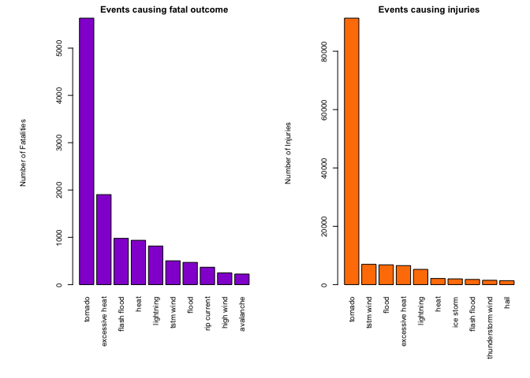
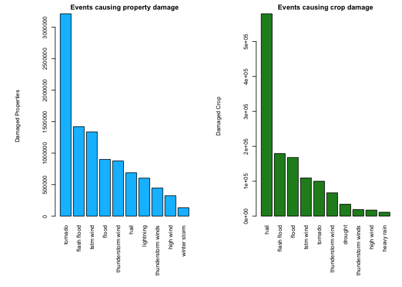

# Reproducible Research: Peer Assessment 2 --> Weather events impacting public health and economy

# Introduction

Storms and other severe weather events can cause both public health and economic problems for communities and municipalities. Many severe events can result in fatalities, injuries, and property damage, and preventing such outcomes to the extent possible is a key concern.

This project involves exploring the U.S. National Oceanic and Atmospheric Administration's (NOAA) storm database. This database tracks characteristics of major storms and weather events in the United States, including when and where they occur, as well as estimates of any fatalities, injuries, and property damage.


# Synopsis

The basic goal of this assignment is to explore the NOAA Storm Database and answer some basic questions about severe weather events. You must use the database to answer the questions below and show the code for your entire analysis. Your analysis can consist of tables, figures, or other summaries. You may use any R package you want to support your analysis.


# Data Processing

## Loading and preprocessing the data

The first step is to load the csv file and store it in the stormData table.


```r
stormData <- read.csv(bzfile("repdata-data-StormData.csv.bz2"), header=TRUE, stringsAsFactors=FALSE, na.strings="NA")
#stormData <- read.csv("StormData.csv")
names(stormData);
```

```
##  [1] "STATE__"    "BGN_DATE"   "BGN_TIME"   "TIME_ZONE"  "COUNTY"    
##  [6] "COUNTYNAME" "STATE"      "EVTYPE"     "BGN_RANGE"  "BGN_AZI"   
## [11] "BGN_LOCATI" "END_DATE"   "END_TIME"   "COUNTY_END" "COUNTYENDN"
## [16] "END_RANGE"  "END_AZI"    "END_LOCATI" "LENGTH"     "WIDTH"     
## [21] "F"          "MAG"        "FATALITIES" "INJURIES"   "PROPDMG"   
## [26] "PROPDMGEXP" "CROPDMG"    "CROPDMGEXP" "WFO"        "STATEOFFIC"
## [31] "ZONENAMES"  "LATITUDE"   "LONGITUDE"  "LATITUDE_E" "LONGITUDE_"
## [36] "REMARKS"    "REFNUM"
```


Some of the events in the file have been recorded differently but still are part the same category i.e. Frost/Freeze, FROST/FREEZE and FROST\\FREEZE. 


```r
# Retreive number of unique event types before clean up
length(unique(stormData$EVTYPE))
```

```
## [1] 985
```

```r
# Make all events lower case
event_types <- tolower(stormData$EVTYPE)
length(unique(event_types))
```

```
## [1] 898
```

```r
# Update storm data frame
stormData$EVTYPE <- event_types
```

## Events harmful to population HEALTH

Find event types that are the most harmful to the population.


```r
library(plyr)
population_casual <- ddply(stormData, .(EVTYPE), summarize,
                    fatalities = sum(FATALITIES),
                    injuries = sum(INJURIES))

# Find events that caused most death and injuries
fatal_events <- head(population_casual[order(population_casual$fatalities, decreasing = T), ], 10)
injury_events <- head(population_casual[order(population_casual$injuries, decreasing = T), ], 10)
```


Top 10 events that caused highest number of deaths and injuries


```r
fatal_events[, c("EVTYPE", "fatalities")]
```

```
##             EVTYPE fatalities
## 758        tornado       5633
## 116 excessive heat       1903
## 138    flash flood        978
## 243           heat        937
## 418      lightning        816
## 779      tstm wind        504
## 154          flood        470
## 524    rip current        368
## 320      high wind        248
## 19       avalanche        224
```

```r
injury_events[, c("EVTYPE", "injuries")]
```

```
##                EVTYPE injuries
## 758           tornado    91346
## 779         tstm wind     6957
## 154             flood     6789
## 116    excessive heat     6525
## 418         lightning     5230
## 243              heat     2100
## 387         ice storm     1975
## 138       flash flood     1777
## 685 thunderstorm wind     1488
## 212              hail     1361
```


## Events have the greatest ECONOMIC consequences

Find event types that are causing gratest economic consequence.


```r
library(plyr)
economic_consequence<- ddply(stormData, .(EVTYPE), summarize,
                    property = sum(PROPDMG),
                    crop = sum(CROPDMG),na.rm=TRUE)

# Find events that caused most property and crop damage
property_damage <- head(economic_consequence[order(economic_consequence$property, decreasing = T), ], 10)
crop_damage <- head(economic_consequence[order(economic_consequence$crop, decreasing = T), ], 10)
```


Top 10 events that caused highest number property and crop damage


```r
property_damage[, c("EVTYPE", "property")]
```

```
##                 EVTYPE  property
## 758            tornado 3212258.2
## 138        flash flood 1420124.6
## 779          tstm wind 1335995.6
## 154              flood  899938.5
## 685  thunderstorm wind  876844.2
## 212               hail  688693.4
## 418          lightning  603351.8
## 711 thunderstorm winds  446293.2
## 320          high wind  324731.6
## 888       winter storm  132720.6
```

```r
crop_damage[, c("EVTYPE", "crop")]
```

```
##                 EVTYPE      crop
## 212               hail 579596.28
## 138        flash flood 179200.46
## 154              flood 168037.88
## 779          tstm wind 109202.60
## 758            tornado 100018.52
## 685  thunderstorm wind  66791.45
## 84             drought  33898.62
## 711 thunderstorm winds  18684.93
## 320          high wind  17283.21
## 254         heavy rain  11122.80
```


# Results

## Visualisation for top fatal and injury casualities 


```r
par(mfrow = c(1, 2), mar = c(10, 8, 2, 1), mgp = c(5, 1, 0), cex = 0.6, las = 3)
barplot(fatal_events$fatalities, names.arg = fatal_events$EVTYPE, col = 'darkviolet',
        main = 'Events causing fatal outcome', ylab = 'Number of Fatalities')
barplot(injury_events$injuries, names.arg = injury_events$EVTYPE, col = 'darkorange1',
        main = 'Events causing injuries', ylab = 'Number of Injuries')
```

 


## Visualisation for top property and crop damage


```r
par(mfrow = c(1, 2), mar = c(10, 8, 2, 1), mgp = c(5, 1, 0), cex = 0.6, las = 3)
barplot(property_damage$property, names.arg = property_damage$EVTYPE, col = 'deepskyblue',
        main = 'Events causing property damage', ylab = 'Damaged Properties')
barplot(crop_damage$crop, names.arg = crop_damage$EVTYPE, col = 'forestgreen',
        main = 'Events causing crop damage', ylab = 'Damaged Crop')
```

 


# Conclusions
Based on the data analysis we may confidently say that the highest impact on the population health has TORNADO.
This event is causing more than 5000 of fatalities. Excessive heat has significant effect on the fatal outcomes also.
Injuries caused by tornado are set above 91 thousands.

In regards to economic consequences tornados once again have significant impact on the property damage. However the crop is mostly affected by hail. 
